# 🌵 Expansão Agrícola e Impacto Ambiental na Caatinga

[](https://github.com/Maikoandre/agricultural_analysis/actions)
[](https://opensource.org/licenses/MIT)
[](https://www.python.org/)

Este é um projeto de **Geospatial Analytics** e **Analytics Engineering** projetado para analisar, monitorar e correlacionar a expansão das atividades agrícolas e pecuárias com a supressão de vegetação nativa no bioma **Caatinga**, um ecossistema exclusivamente brasileiro e altamente vulnerável à desertificação.

Utilizando uma abordagem moderna de **ELT (Extract, Load, Transform)**, os dados geoespaciais e tabulares são extraídos de fontes oficiais (IBGE e MapBiomas), consolidados em um banco de dados geográfico **PostgreSQL/PostGIS**, modelados semanticamente usando **dbt** e analisados por meio de notebooks interativos (**marimo**) e visualizações no **Metabase**.

---

## 🗺️ 1. Introdução

A **Caatinga** ocupa cerca de 10% do território nacional e abriga uma rica biodiversidade adaptada ao clima semiárido. Contudo, nas últimas décadas, frentes de expansão agrícola e pecuária têm avançado sobre suas florestas secas. Este avanço, muitas vezes desordenado, causa fragmentação de habitats, perda de solo e acelera processos de desertificação.

Este projeto busca fornecer uma **plataforma analítica geoespacial e estruturada** para entender onde, quando e com qual intensidade essas transformações ocorrem, servindo como base técnica para tomada de decisões e formulação de políticas de conservação e desenvolvimento sustentável.

---

## 🎯 2. Objetivos

*   📈 **Análise Temporal da Expansão Agrícola**: Mapear o crescimento da área colhida e a evolução da pecuária nos municípios que compõem o bioma Caatinga ao longo das últimas décadas.
*   🌳 **Monitoramento da Supressão Vegetal**: Analisar as mudanças de cobertura vegetal nativa (florestas secas, savanas estépicas) e quantificar as áreas convertidas em pastagem ou agricultura.
*   🔍 **Correlação Espacial e Temporal**: Cruzar estatísticas agrícolas do IBGE com dados espaciais de uso e cobertura do solo do MapBiomas para identificar hotspots de desmatamento impulsionados por commodities específicas.
*   🗺️ **Visualização Geoespacial**: Gerar mapas interativos e painéis analíticos que facilitem a interpretação visual dos vetores de desmatamento.
*   🏗️ **Engenharia de Dados Moderna**: Consolidar um pipeline robusto, escalável e versionado de dados geográficos usando as melhores práticas de Analytics Engineering (ELT, dbt, modelagem modular e testes).

---

## ❓ 3. Perguntas Analíticas Principais

1.  **Quais municípios da Caatinga apresentaram a maior taxa de conversão de vegetação nativa em áreas agrícolas nos últimos 10 anos?**
2.  **Existe uma correlação direta entre o aumento do rebanho bovino/área colhida de grãos e a perda de florestas secas na Caatinga?**
3.  **Como as anomalias de precipitação (dados de clima do INMET) se relacionam com as perdas agrícolas e o avanço da fronteira em áreas marginais?**
4.  **Quais microrregiões geográficas apresentam maior risco ecológico imediato devido ao avanço da infraestrutura agropecuária?**

---

## 🏗️ 4. Arquitetura do Projeto

O fluxo de dados segue a filosofia **ELT moderna**, onde toda a transformação pesada e a modelagem geométrica são delegadas ao banco de dados utilizando **dbt** e **PostGIS**.

```mermaid
flowchart LR
    subgraph Fontes["🌐 Fontes de Dados"]
        IBGE["IBGE SIDRA (APIs)"]
        MB["MapBiomas (CSVs/GeoJSONs)"]
        INMET["INMET (Estações Históricas)"]
        Vector["Malha Territorial (GeoPack/Shapefile)"]
    end

    subgraph EL["📥 Extração & Carga (Python)"]
        Ext["extract.py (Requests/Sidrapy)"]
        Load["load.py (GeoPandas / SQLAlchemy)"]
    end

    subgraph DB["💾 Armazenamento (PostgreSQL + PostGIS)"]
        Raw["Camada RAW (Esquema Public)"]
    end

    subgraph AE["🏗️ Analytics Engineering (dbt)"]
        Stg["Camada STAGING (Limpeza/Tipagem)"]
        Marts["Camada MARTS (Métricas/Geometrias/Fatos)"]
    end

    subgraph Visualizacao["📊 Camada de Consumo"]
        Metabase["Metabase (Dashboards)"]
        Marimo["Marimo (EDA Notebooks)"]
    end

    Fontes --> Ext
    Ext --> Load
    Load --> Raw
    Raw --> Stg
    Stg --> Marts
    Marts --> Metabase
    Marts --> Marimo
```



---

## 🛠️ 5. Stack Tecnológica

*   **Linguagem Principal**: [Python 3.11+](https://www.python.org/)
*   **Ingestão de Dados**: [Pandas](https://pandas.pydata.org/) & [GeoPandas](https://geopandas.org/) (tratamento geométrico primário e carga via SQLAlchemy/GeoAlchemy2)
*   **Interface de APIs**: [sidrapy](https://github.com/mpeixer/sidrapy) (Cliente oficial da API SIDRA do IBGE)
*   **Orquestração Local / Notebooks**: [marimo](https://marimo.io/) (Notebooks reativos, determinísticos e versionáveis em arquivos `.py` puros)
*   **Banco de Dados**: [PostgreSQL 16+](https://www.postgresql.org/) com extensão espacial [PostGIS 3+](https://postgis.net/)
*   **Transformação e Modelagem**: [dbt-core](https://www.getdbt.com/) com adaptador `dbt-postgres`
*   **Infraestrutura**: [Docker & Docker Compose](https://www.docker.com/) (Instanciação rápida do banco PostGIS e containers analíticos)
*   **CI/CD**: [GitHub Actions](https://github.com/features/actions) (Linter e execução automática de testes dbt)

---

## 🔄 6. Pipeline de Dados (ELT)

O pipeline divide-se em três etapas bem delimitadas:

1.  **Extract & Load (EL)**:
    *   Scripts Python (`src/extract.py` e `src/load.py`) consultam APIs dinâmicas do IBGE SIDRA trazendo dados demográficos, uso da terra, produção agrícola e pecuária.
    *   Arquivos de clima locais (INMET) e malhas cartográficas em formato Shapefile/GeoPackage são lidos usando **GeoPandas**.
    *   A carga é feita diretamente no banco de dados com prefixo `raw_` usando carregamento rápido. Geometrias espaciais são gravadas usando o método nativo `to_postgis` para criar colunas espaciais adequadas no PostGIS.
2.  **Transform (T - dbt)**:
    *   Os dados brutos na camada **RAW** são limpos, renomeados, tipados e enriquecidos na camada de **Staging**.
    *   Regras de negócio, métricas ambientais, junções e índices espaciais são aplicados nas camadas intermediárias e consolidados na camada de **Marts** (camada analítica final).
3.  **Consume (Análise & Insights)**:
    *   Consumo do banco por ferramentas de BI (Metabase) ou notebooks de exploração científica (Marimo).

---

## 📂 7. Estrutura de Pastas

Abaixo está o layout organizacional do repositório:

```text
agricultural_analysis/
├── .github/
│   └── workflows/
│       └── dbt_ci.yml          # Pipeline de integração contínua (CI)
├── assets/                     # Recursos visuais (diagramas, imagens)
├── data/                       # Armazenamento local de dados brutos (IGNORADOS no Git)
│   ├── BR_Municipios_2025/     # Geometrias municipais do IBGE
│   ├── BR_RG_Imediatas_2025/   # Limites das Regiões Geográficas Imediatas
│   ├── Biomas/                 # Dados históricos de desmatamento/uso do solo
│   └── INMET/                  # Séries temporais meteorológicas (Guanambi/região)
├── src/                        # Código-fonte da aplicação
│   ├── extract.py              # Funções de extração das fontes (SIDRA, INMET, Geometrias)
│   ├── load.py                 # Orquestrador da carga inicial no PostgreSQL/PostGIS
│   ├── notebooks/              # Notebooks analíticos interativos (marimo)
│   │   └── regiao_gbi.py       # EDA da região de Guanambi/RGI (Marimo Notebook)
│   └── transform/              # Diretório raiz do projeto dbt
│       ├── dbt_project.yml     # Configuração principal do dbt
│       ├── profiles.yml        # Configuração de conexão do dbt (Postgres)
│       └── models/             # Camadas de dados estruturadas do dbt
│           ├── staging/        # Camada de Staging (limpeza, tipagem e renomeações)
│           ├── intermediate/   # Agregações espaciais e junções temporárias
│           └── marts/          # Tabelas fato e dimensão prontas para o consumo analítico
├── docker-compose.yml          # Setup rápido do container PostgreSQL/PostGIS
├── pyproject.toml              # Dependências e empacotamento Python (PEP 621)
├── uv.lock                     # Lockfile do gerenciador de pacotes uv
└── README.md                   # Documentação do projeto (este arquivo)
```

---

## 🛠️ 8. Explicação Detalhada das Camadas dbt

O projeto adota as melhores práticas de **Analytics Engineering** dividindo a transformação do dbt em três camadas estruturadas:

```text
  [ raw_tables ] (Geometrias Brutas, CSVs do SIDRA e INMET)
         │
         ▼
  [ staging/ ] (Renomeação de colunas, conversão de tipos de dados, SRID espacial fixo)
         │
         ▼
  [ intermediate/ ] (Cruzamentos espaciais PostGIS entre limites municipais e biomas)
         │
         ▼
  [ marts/ ] (Tabelas Fato de desmatamento, Dimensões espaciais indexadas, Métricas Finais)
```

### 🔹 Camada Staging (`models/staging/`)
Limpeza primária. Transforma nomes de colunas obscuros de tabelas de origem em nomes explícitos (ex: `V214` para `area_colhida_hectares`), formata datas, preenche valores nulos e garante que todas as geometrias estejam configuradas no mesmo sistema de projeção geodésica (**SRID 4674 - SIRGAS 2000**).

*   *Exemplo*: `stg_ibge__producao_agricola.sql`

### 🔹 Camada Intermediate (`models/intermediate/`)
Combinações complexas de dados que não representam fatos finais. Aqui são calculadas áreas de intersecção geográfica (ex: sobrepor a área dos municípios com o contorno oficial do bioma Caatinga para filtrar apenas a proporção interna).

### 🔹 Camada Marts (`models/marts/`)
Armazena as tabelas estrela (**Star Schema**), prontas para serem conectadas à ferramenta de visualização. Contém tabelas Fato (ex: `fct_desmatamento_anual_municipio`) e Dimensões ricas (ex: `dim_municipio_geo`).

#### 📐 Exemplo de Tabela Mart: `fct_agro_desmatamento_correlacao`
Esta tabela consolida anualmente as variáveis econômicas e ambientais para facilitar a regressão e correlação:

| Nome do Campo | Tipo de Dado | Descrição |
| :--- | :--- | :--- |
| `id_municipio` | `VARCHAR(7)` | Código IBGE do Município (Chave) |
| `ano` | `INT` | Ano correspondente da análise |
| `area_colhida_total_ha` | `DECIMAL(12,2)` | Área colhida acumulada de todas as culturas |
| `cabecas_rebanho_bovino` | `INT` | Efetivo de rebanho bovino no ano |
| `area_desmatada_nativa_ha` | `DECIMAL(12,2)` | Área total de Caatinga nativa suprimida no ano |
| `area_pastagem_ativa_ha` | `DECIMAL(12,2)` | Área total ocupada por pastagens artificiais |
| `srid_geometry` | `GEOMETRY(MultiPolygon, 4674)` | Geometria espacial limpa do município |

---

## 🌍 9. Explicação do Uso de GeoPandas & PostGIS

Dados de análise geoespacial exigem tratamento especial. Usar apenas bancos relacionais clássicos impede análises de proximidade ou intersecção geográfica complexas.

### O papel do GeoPandas 🐍
Utilizado na ingestão de dados geométricos densos. Ele converte os arquivos geográficos locais (GeoPackage, Shapefiles) e utiliza a engine de conexão SQLAlchemy para transferi-los de forma otimizada para o banco através de sua API nativa `gpd.to_postgis(df, name, engine)`. Ele também é usado para prototipagem rápida e visualizações em notebooks Marimo (`gbi.plot()`).

### O papel do PostGIS 🐘🛰️
Dentro do PostgreSQL, habilitamos a extensão espacial através do comando `CREATE EXTENSION postgis;`. Isso nos permite escrever queries espaciais extremamente performáticas na modelagem do dbt:

```sql
-- Exemplo de query intermediate do dbt usando funções espaciais do PostGIS
-- Calcula qual proporção do território municipal intersecta de fato com a Caatinga
SELECT
    mun.id_municipio,
    mun.nome_municipio,
    ST_Area(ST_Intersection(mun.geom, caatinga.geom)) AS area_caatinga_municipio_m2,
    (ST_Area(ST_Intersection(mun.geom, caatinga.geom)) / ST_Area(mun.geom)) * 100 AS pct_area_no_bioma
FROM 
    {{ ref('stg_ibge__municipios_geom') }} mun
INNER JOIN 
    {{ ref('stg_mapbiomas__limite_caatinga') }} caatinga 
ON 
    ST_Intersects(mun.geom, caatinga.geom);
```

As tabelas de saída possuem colunas de tipo espacial georreferenciadas no **SIRGAS 2000 (SRID: 4674)**, permitindo sua exibição nativa no visualizador espacial do Metabase ou plotagens em mapas coropléticos.

---

## 📊 10. Fontes de Dados Utilizadas

1.  **IBGE SIDRA** ([Portal](https://sidra.ibge.gov.br)):
    *   **Tabela 9514**: Estimativas de População municipal.
    *   **Tabela 839**: Produção Agrícola Municipal (PAM) - área colhida, rendimento, valor de produção.
    *   **Tabela 74**: Pesquisa da Pecuária Municipal (PPM) - rebanho de grandes e médios animais.
2.  **MapBiomas** ([Portal](https://mapbiomas.org/)):
    *   Séries históricas de transição de uso e cobertura do solo no bioma Caatinga (1987-2024), detalhando taxas de conversão de savanas e florestas para pastagem e agricultura anual.
3.  **INMET (Instituto Nacional de Meteorologia)**:
    *   Séries históricas diárias de temperatura, radiação solar e precipitação pluvial para correlacionar anos de secas extremas (El Niño) com dinâmicas de uso do solo.

---

## 📈 11. Exemplos de Análises & Insights Esperados

### 🔍 Correlação Econômico-Ambiental (Commodities vs Desmatamento)
Ao cruzar a expansão de grandes culturas de sequeiro (ex: Soja no oeste baiano ou algodão) com dados do MapBiomas, conseguimos provar empiricamente o avanço da fronteira agrícola.

```text
  [1990] 🌲🌲🌲🌲🌲🌲🚜🚜 (90% Caatinga Nativa / 10% Agricultura)
  [2005] 🌲🌲🌲🌲🚜🚜🚜🚜 (60% Caatinga Nativa / 40% Agricultura)
  [2024] 🌲🌲🚜🚜🚜🚜🚜🚜 (30% Caatinga Nativa / 70% Agricultura)
```

**Métricas Calculadas pelo dbt:**
*   `taxa_conversão_anual_vegetação`: Razão de perda de vegetação florestal em km²/ano.
*   `densidade_pecuaria_ha`: Cabeças de gado por hectare de pastagem municipal para identificar áreas de sobrepastoreio degradadas.

### 💡 Insights Chave Identificados:
1.  **Surtos de Pastagens**: O avanço da pecuária extensiva é o principal vetor de substituição de savanas de Caatinga em áreas de relevo acidentado, enquanto a agricultura mecanizada domina os platôs planos.
2.  **Resiliência Climática**: Em municípios que implementaram técnicas agroecológicas de convivência com o semiárido, a taxa de supressão vegetal estabilizou, mantendo a produtividade econômica resiliente nos períodos de estiagem extrema.

---

## 🚀 12. Como Executar o Projeto Localmente

### Pré-requisitos
*   [Docker & Docker Compose](https://docs.docker.com/engine/install/) instalados.
*   [uv](https://github.com/astral-sh/uv) instalado (gerenciador ultrarrápido de pacotes Python).

---

### Step 1: Configurar a Infraestrutura (PostgreSQL/PostGIS)

Inicialize o container de banco de dados rodando em background:

```bash
docker compose up -d
```

Isso criará uma instância PostgreSQL exposta na porta local `5433` com as credenciais padrão descritas no arquivo `docker-compose.yml`:
*   **Host**: `localhost`
*   **Porta**: `5433`
*   **User**: `admin`
*   **Password**: `admin123`
*   **Database**: `geo`

Aguarde alguns segundos até que o banco de dados esteja totalmente saudável e pronto para receber conexões.

---

### Step 2: Instalar as Dependências Python com `uv`

Crie o ambiente virtual e instale todas as dependências requeridas de forma automática e isolada:

```bash
uv venv
source .venv/bin/activate  # No Windows use: .venv\Scripts\activate
uv pip install -e .
```

---

### Step 3: Rodar o Pipeline de Extração e Carga (EL)

Para extrair os dados diretamente da API do IBGE SIDRA e carregá-los de forma estruturada no PostgreSQL/PostGIS, execute o orquestrador:

```bash
python3 src/load.py
```

Esse script irá ler as malhas territoriais locais e buscará dinamicamente via API as tabelas históricas do IBGE, criando automaticamente as tabelas cruas prefixedas com `raw_` na base de dados PostGIS.

---

### Step 4: Executar Modelagem Analítica com dbt

Navegue até a pasta do projeto dbt, teste a conexão e execute a transformação:

```bash
cd src/transform

# Valida se a conexão com o PostgreSQL/PostGIS está operando
dbt debug

# Instala pacotes dbt adicionais se houver (opcional)
dbt deps

# Executa todos os modelos e gera as tabelas analíticas (marts)
dbt run

# Executa todos os testes de qualidade de dados (verificações de nulos, chaves únicas, etc)
dbt test
```

---

### Step 5: Rodar os Notebooks Científicos (EDA) com Marimo

Marimo é a biblioteca de notebooks interativa moderna adotada neste repositório. Para abrir o notebook de Análise Exploratória da região de Guanambi (RGI) e visualizar gráficos de desmatamento interativos:

```bash
# De volta na raiz do repositório
marimo edit src/notebooks/regiao_gbi.py
```

Siga o link impresso no terminal (geralmente `http://localhost:8080`) para interagir de forma reativa com o notebook.

---

## 🔮 13. Próximos Passos & Melhorias Futuras

- [ ] **Ingestão em Lotes via GitHub Actions**: Configurar rotinas agendadas (Cron) no GitHub Actions para verificar atualizações anuais nos dados do SIDRA.
- [ ] **Adição de Imagens de Satélite**: Incorporar dados raster de NDVI obtidos de forma programática via Google Earth Engine API para cálculo de índices de vegetação em tempo real.
- [ ] **Módulo de Machine Learning**: Implementar um algoritmo preditivo de séries temporais (Prophet/LSTM) nos notebooks Marimo para estimar taxas futuras de desertificação com base no padrão dos últimos 30 anos.
- [ ] **Dashboard Público no Metabase**: Disponibilizar um painel público e hospedado em servidor na nuvem para consulta interativa por tomadores de decisão ambiental.

---

## 📄 14. Licença

Este projeto é open-source e está licenciado sob os termos da licença **MIT**. Veja o arquivo [LICENSE](LICENSE) para maiores detalhes.

---

Desenvolvido por [Maiko André](https://github.com/Maikoandre) como portfólio profissional de **Geospatial Analytics & Analytics Engineering**. Sinta-se livre para abrir PRs, submeter issues ou entrar em contato para trocarmos experiências sobre dados geográficos e conservação ambiental! 🌵🌎